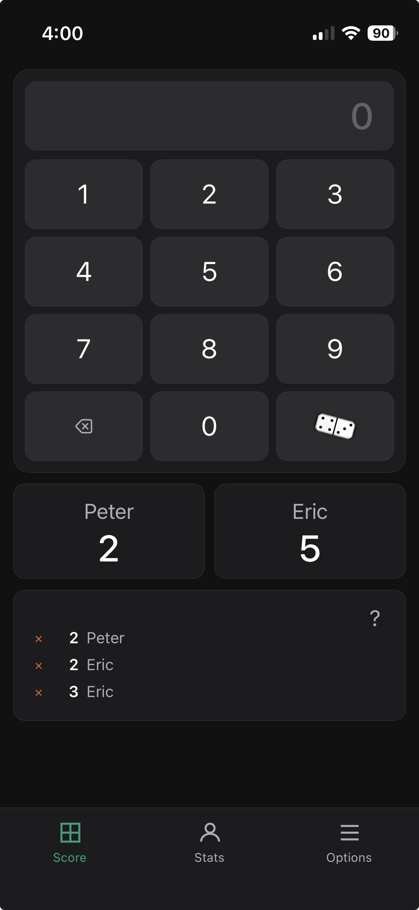

# Dominoes Scorekeeper

A lightweight browser-based scorekeeper for dominoes games. Record games quickly, compare player performance over time, and explore trends with simple, mobile-friendly analytics.

## Features

### Game Tracking

* Record completed dominoes games in seconds
* Track multiple players and contest sessions
* Automatically identify winners and final standings
* Keep a permanent history in your browser

### Lifetime Statistics

Track long-term performance across many games:

* Games played
* Wins
* Win percentage
* Total points scored
* Average score
* Highest score
* Ranking history

### Visual Analytics

View player trends at a glance:

* Cumulative points history
* Games played over time
* Win distribution
* Margin-of-victory histograms
* Performance comparisons

### Mobile Friendly

* Works on phones, tablets, and desktops
* No login required
* No backend server required
* Designed for use during actual game play

## Why This Exists

Long time friend Peter and I have played dominoes for years. We kept scores on scraps of paper, and graphs on sheets of graphpaer taped together.

We would scheme on an alternative to pencil-and-paper scorekeeping: a fast, browser-based alternative that preserves game history and reveals who is really winning over time. It would:

* Preserve game history permanently
* Track lifetime statistics automatically
* Surface winning trends and rankings
* Provide useful charts and insights
* Run in any modern browser

The arrival of AI coding tools was too tempting, this is the result.

## Screenshots

### Score Entry

The main screen is where scoring happens. Enter points and tap a player tile to assign points to that player.

The player with the highest double starts the first hand. Tap that player to begin a new game, then record each hand by selecting scores.

When a player plays all their tiles, tap the domino tile below the 9 to mark the hand complete. The status area will summarize the hand and indicate who plays next.

After a domino play, the player with the most points above the top score is declared the winner. The status area then waits for another domino tile tap to begin the next game.

The help area shows recent scores, and the red X icon deletes an entry for quick edits.

### Statistics Dashboard

The statistics screen provides quick summaries, charts, and distributions.

Use the export option to analyze raw game data in another tool, calculate streaks, or build custom reports.

### Options

The options screen lets you define player names, set the top score, and toggle dark mode.

## Getting Started

Visit:

https://evanvliet.github.io/dominoes

You will see the options tab above.  Enter the player names
for your first contest and begin scoring on the scores tab.

Most modern browsers can install the app to your home screen
for a more native experience.
* Android (Chrome): Go to the site, tap the three dots beside
the address bar, and select Add to Home screen.
* iOS (Safari): Go to the website, tap the Share button at
the bottom of the screen, and select Add to Home Screen.

## Data Storage

Game history is stored locally in your browser using local storage.

That means:

* No account required
* No cloud service required
* Your data stays under your control

Because data is stored locally, be sure to export or back up your history if you want to preserve it.

## Statistics Tracked

| Statistic         | Description                             |
| ----------------- | --------------------------------------- |
| Games Played      | Total recorded games                    |
| Wins              | First-place finishes                    |
| Win Percentage    | Wins ÷ Games Played                     |
| Total Points      | Lifetime points scored                  |
| Average Score     | Mean score per game                     |
| Highest Score     | Best game score                         |
| Margin of Victory | Difference between winner and runner-up |

## Future Enhancements

Potential improvements:

* Data import/export
* Cloud synchronization
* Tournament mode
* Team play support
* Additional chart types
* Player profiles
* Progressive Web App (PWA) support
* Installable mobile app experience

## Contributing

Bug reports, feature requests, and pull requests are welcome.

Report issues at: https://github.com/evanvliet/dominoes/issues

## License

MIT License
