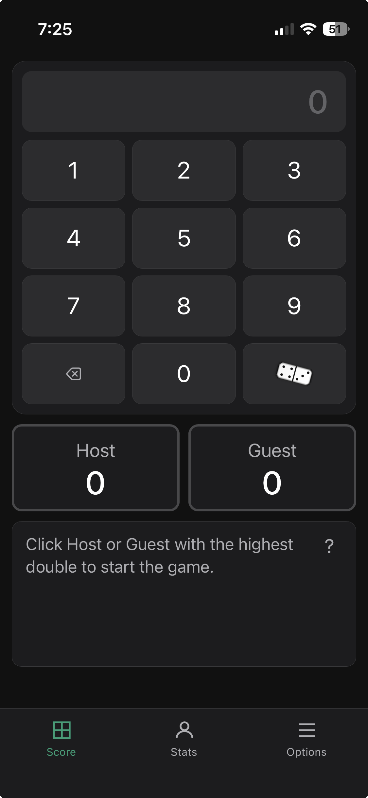
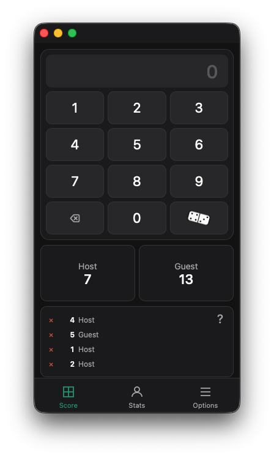
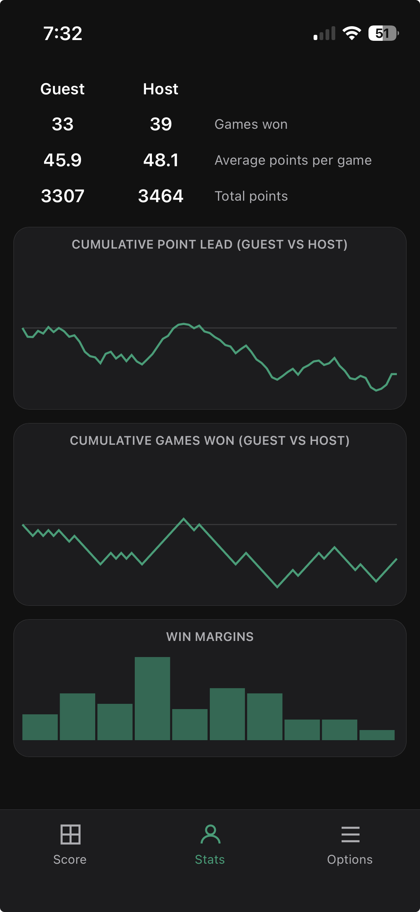
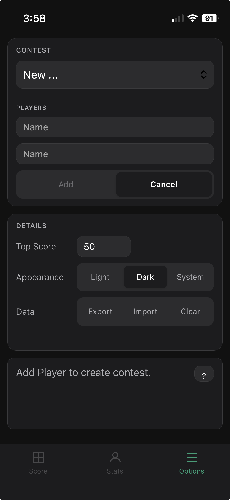

# Dominoes Scorekeeper

A lightweight browser-based scorekeeper for dominoes games. Record games quickly, compare player performance over time, and explore trends with simple, mobile-friendly analytics.

## Usage

Visit:

https://evanvliet.github.io/dominoes

You will see the main scoring tab:

To start a game, click on
the player with the highest double. Then enter numbers and credit
a score by clicking the player tile.

After entering some scores, note the status area lists some recent ones.

Click the red **X** to delete that score, and possibly replace by adding another score.

When a player *goes out* (plays all their tiles), first enter any score from that play, then tap the domino tile below the **9** to mark the hand complete. The status area shows hand totals and who plays next.

After a domino play, the player with the most points above the top score wins.
The status area shows the winner. Tap the domino tile to begin the next game.

There are also Statistics and Options tabs. Statistics has running totals, averages and charts. 

Use Options to set up separate contests labeled by player names. Click on the CONTEST dropdown and select **New...** to set the players. You can also configure top score, dark mode, and import/export of data. Screenshots:

| Statistics | Options |
| :--- | :--- |
|  |  |

For more detail, background info, usage sugesstions, see [info](info.md).