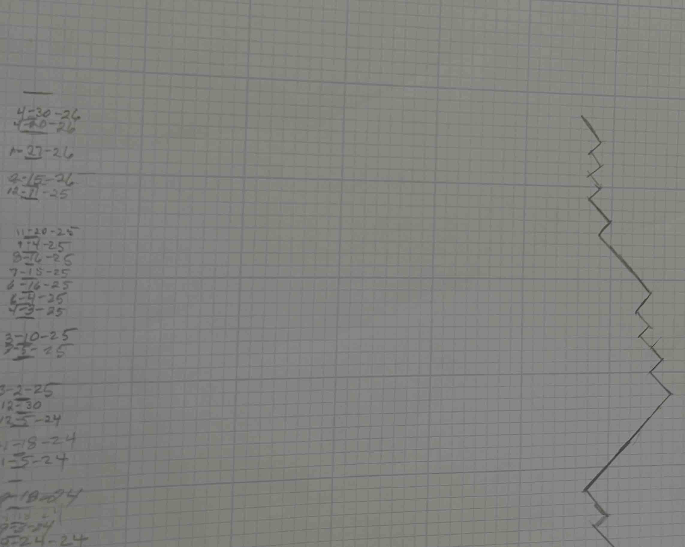
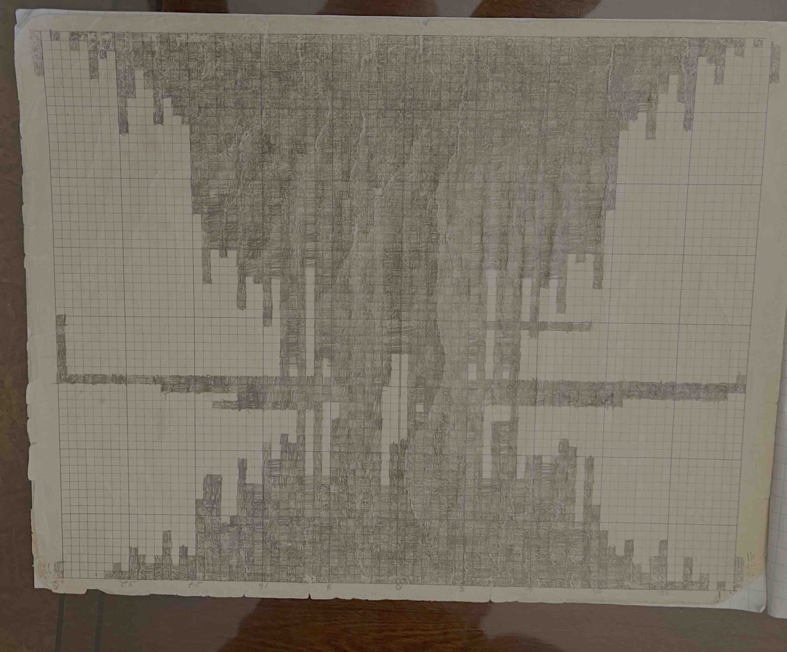
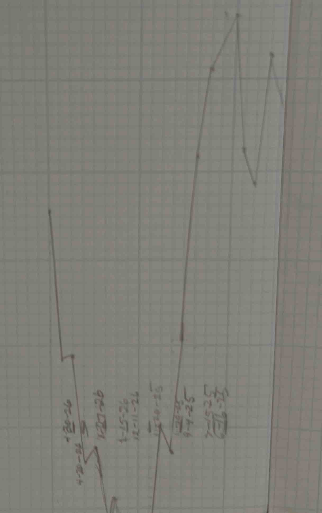
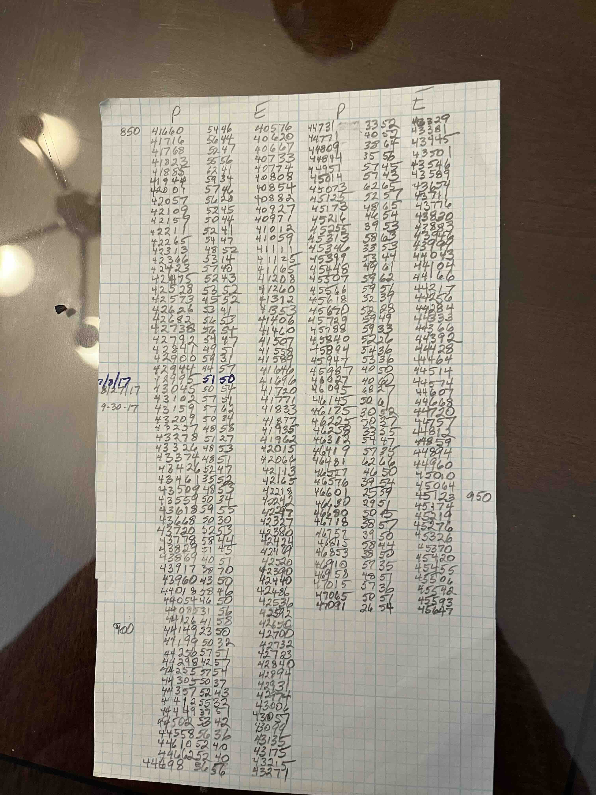

# Dominoes Scorekeeper

A lightweight browser-based scorekeeper for dominoes games. Record games quickly, compare player performance over time, and explore trends with simple, mobile-friendly analytics.

## Usage

Visit:

https://evanvliet.github.io/dominoes

You will see the main scoring tab, note status advising to click on highest double. This is for play where who goes first alternates on each hand, the one with the highest double starts.


After selecting the starting player, add scores by entering a number and clicking on the scorer.
After some play, the status lists recent scores.
Click the red **X** to delete a score, and possibly replace by adding another score.

 

When a player *dominoes* (plays all their tiles), the hand ends. First enter any score from that play, then tap the domino tile below the **9** to mark the hand complete. The status area shows hand totals and who plays next.

After a domino, the player with the most points above the top score wins.
The status area shows the winner. Tap the domino tile to begin the next game.

There are also Statistics and Options tabs. Statistics has running totals, averages and charts. Screenshots: 

| Statistics | Options |
| :--- | :--- |
|  |  |

Use Options to set up separate contests labeled by player names. Click on the CONTEST dropdown and select **New...** to set the players. You can also configure top score, dark mode, and import/export of data.

### Web App

Browsers can install the app to your home screen
for a more native experience:
* Android (Chrome): Go to the site, tap the three dots beside
the address bar, and select Add to Home screen.
* iOS (Safari): Go to the website, tap the Share button at
the bottom of the screen, and select Add to Home Screen.

### Data

The options tab includes Data buttons for Export, Import, and Clear.
* *Export* pastes current contest as plain ascii into the clipboard: 

    ```text
    Host | Guest 
    5/31 09:33 40 50
    5/31 09:32 51 45
    ```

    First player names, followed by date, time and player scores for each completed game. You have to paste the clipboard data into a mail message or web document to save it.
* *Import* opens an edit control; paste data in above format to add scores. It
 appends scores to the contest per the first line. If no such contest exists, it creates
 a new one. For testing, you can import 75 scores from [test75](test75).
* *Clear* deletes the contest, both scores and players, from the data.

## Why This Exists

Long time friend Peter and I have played dominoes for years. We kept scores on scraps of paper, and graphs on sheets of graph paper taped together. Here's a gallery of those:

| Games / Points | Histogram / Scores |
|-|-|
||. |
|||

We would scheme on an alternative to pencil-and-paper scorekeeping: a fast, browser-based alternative that preserves game history and reveals who is really winning over time. It would:

* Preserve game history permanently
* Track lifetime statistics automatically
* Surface winning trends and rankings
* Provide useful charts and insights
* Run in any modern browser

The arrival of AI coding tools was too tempting, and this is the result.

### More info
See [prompts](prompts.md) for the initial development logs.
And [info](info.md) has AI genearted feature details.


